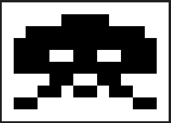
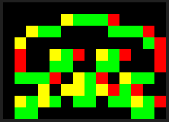
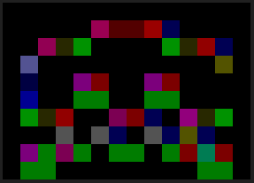
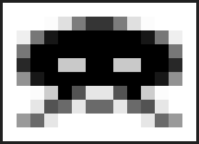

# MLAA-python

A simple python implementation of Morphological Antialiasing

## Requirements

- tqdm
- numpy

## Usage

```shell
python mlaa-cpu.py --origin {your_folder}
```

```shell
optional arguments:
  -h, --help         show this help message and exit
  --origin DIR_ORI   folder of origin images
  --target DIR_TAR   target folder of result images. Default path is
                     "{DIR_ORI}_out/"
  --save STR_SUFFIX  result images suffix
  --type STR_TYPE    type string for finding img edges. "L": using luminance;
                     "P": using per-channel color value
  --th NUM_TH        threshold for finding edges
```

## Figures

### Input



### Edge



### Weight



### Result

